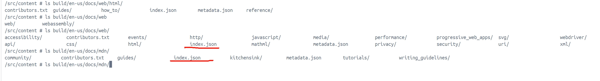

简单介绍以下MDN相关源码说明
* `mdn/content`: MDN文档源码(就是看到的[Web网页](https://developer.mozilla.org)中的文字内容)
* `mdn/translated-content`: MDN文档翻译源码
* `mdn/rari`: MDN文档的构建工具，生成渲染代码，用json格式存储渲染数据
* `mdn/yari`: MDN文档渲染工具，用于渲染`mdn/rari`生成的渲染数据,通过`json`生成`html`文件
* 通过`rari,yari`实现内容维护与渲染分离，便于维护和扩展
  * 当然缺点是本地搭建也**烦**

# 步骤
1. 环境准备
2. 克隆源码
3. 安装依赖
4. 项目打包
   1. 方案一：通过[`mdn/content`](#方案一mdncontent打包)自身实现打包
   2. 方案二：通过[`mdn/yari`](#方案二mdnyari打包推荐)实现`mdn/content`打包(**推荐**)
5. docker部署(依个人需要)

## 1. 环境准备
1. 系统环境：
   1. docker镜像`node-20.18.1:apline`(为适应以下改称`dongle/node:apline`)
   2. docker镜像`openresty:apine`(为忽略URL大小写【转小写】)
2. 安装Git,Nodejs(>=20),yarn()
   1. 见源码`package.json`要求

## 2. 打包
### 方案一：mdn/content打包(不推荐，未成功)
1. 克隆源码
```shell
git clone https://github.com/mdn/content.git # main:828b5565eab82401a8fc1b2475b74cf6be25e371
```
2. 安装依赖
```shell
cd yari
yarn install --ignore-scripts # 跳过周期命令, 因部分命令对系统命令要求较多，可查看 问题分享

# yarn build # 不要先执行，由于跳过周期命令，导致rari安装不完整，缺少可执行文件
# 生成rari可执行文件
# cd node_modules/@mdn/rari 
# yarn install
# 或重新安装 
yarn add @mdn/rari # 生成rari可执行文件
```
3. 项目打包
```shell
cd /src/content # 返回content目录
yarn build # 生成build目录

# 打包后生成build目录只有文档内容，**没有静态资源**如css,js,images等，需要从`yari`依赖中拷贝
cp -r node_modules/@mdn/yari/client/build/* build/  # 从yari以来中拷贝静态资源
```


### 翻译文档打包
```shell
cd /src # content上层目录,路径随便，下面能配置准确即可

# 克隆翻译项目
git clone https://github.com/mdn/translated-content.git # main:dbb8a1600db8dc6455522a7bd813d1254289a475

# 拷贝翻译文档，已`zh-cn`为例
cp -r translated-content/files/zh-cn/* content/translated-content/files/zh-cn/

cd /src/content # 返回content目录
# CONTENT_TRANSLATED_ROOT=../translated-content/files yarn build # 打包所有翻译文档
CONTENT_TRANSLATED_ROOT=./translated-content/files yarn build --locale zh-cn # 打包指定翻译文档
```

### 方案二：mdn/yari打包(推荐)
1. 克隆源码
```shell
# 建议 content + yari 要同目录
git clone https://github.com/mdn/content.git # main:828b5565eab82401a8fc1b2475b74cf6be25e371
git clone https://github.com/mdn/yari.git  # main:25f3e66506c5bc457ba7ac19fe197f39741d364e
```
2. 安装依赖
```shell
cd yari
yarn install --ignore-scripts # 跳过周期命令
yarn add @mdn/rari # 生成rari可执行文件
```
3. 拷贝`.env-dist`文件为`.env`
```shell
# 注意 CONTENT_ROOT 绑定实际的目录，若是同父级目录，无需修改
CONTENT_ROOT=../content/files
#CONTENT_TRANSLATED_ROOT=../translated-content/files
#CONTRIBUTOR_SPOTLIGHT_ROOT=../mdn-contributor-spotlight/contributors
#GENERIC_CONTENT_ROOT=../generic-content/files

REACT_APP_DEV_MODE=true

# See documentation in docs/envvars.md for more information about this
#BUILD_FLAW_LEVELS=broken_links:error, macros:ignore
```
4. 打包文档
``` shell
cd /src/yari # 返回yari目录

# 构建前准备
yarn build:prepare # 先构建client和ssr

yarn build # 打包内容输出到 client/build目录
```
   * 翻译文档打包：逻辑类似[上方](#翻译文档打包)
     * 需要修改`.env`配置
    ```properties
    CONTENT_TRANSLATED_ROOT=../translated-content/files # 启动翻译文档打包
    ```
1. 打包后生成文档，只有`index.json`，没有`index.html`需要进一步渲染
   1. 注意：渲染依赖`client,ssr`，并且需要在构建前先执行构建准备`yarn build:prepare`
```shell
yarn render:html # 渲染文档 
```

## 3. 部署
* 处理访问路径大写，而生成的文件小写问题
  * 如`/en-US/docs/Web/HTML`对应文件`/en-us/docs/web/html/index.html`
  * 主要通过nginx配置`lua`脚本将URI转为小写寻找静态资源文件
```conf
server {
    listen       8080;
    server_name  localhost;

    root /usr/local/openresty/nginx/html;
    # 使用Lua转换路径为小写
    set_by_lua $lower_uri '
        return string.lower(ngx.var.uri)
    ';

    location /{
       try_files $lower_uri $lower_uri/index.html =404; # 尝试以小写uri寻找文件路径
    }

    location ~* \.(css|js|png|jpg|jpeg|gif|ico|svg|woff|woff2|ttf|eot)$ {
        try_files $uri =404;
    }
    
    location = /404{
        rewrite ^ /en-US/404 permanent;
    }
    error_page  500 502 503 504  /50x.html;
}
```
* **方案一：外部打包构建**
```Dockerfile
FROM dongle/openresty:alpine
COPY build /usr/local/openresty/nginx/html

# docker build --no-cache -t dongle/mdn -f Dockerfile .
# docker run -d --name mdn -p 8080:8080 -v default.conf:/etc/nginx/conf.d/default.conf dongle/mdn
``` 
* **方案二：一键构建**(**暂未成功**)
```Dockerfile
FROM dongle/node:20 AS build
RUN apk add git
WORKDIR /src
COPY content ./content
COPY yari ./yari
WORKDIR yari
RUN yarn install --ignore-scripts
# RUN yarn remove  @mdn/rari --ignore-scripts
RUN yarn add @mdn/rari
RUN yarn build:prepare
RUN yarn build
RUN yarn render:html


FROM dongle/openresty:alpine
COPY --from=build /src/yari/client/build /usr/local/openresty/nginx/html

# docker build --no-cache -t dongle/mdn -f Dockerfile .
# docker run -d --name mdn -p 8080:8080 -v ./default.conf:/etc/nginx/conf.d/default.conf dongle/mdn
```

# 问题
**以下问题仅个人遇到，仅供参考，如有其他问题请自行解决**

## content打包web文档子无法访问问题(重点)
* 原因：`content`打包后，web文档中没有静态资源文件`index.html`,只有`index.json`，需要二次渲染才可以显示
* 解决：通过`yari`项目进行渲染
  * **还未找到直接执行的命令**：(有了解的，方便分享下吗)
  * 直接下载`yari`源码，通过源码中的脚本命令`yarn render:html`进行渲染(需要配置`.env`绑定内容目录)

## `npm install`报错
```txt
/src/yari # yarn install
yarn install v1.22.22
[1/5] Validating package.json...
[2/5] Resolving packages...
[3/5] Fetching packages...
[4/5] Linking dependencies...
warning "@codemirror/lang-css > @codemirror/autocomplete@6.18.3" has unmet peer dependency "@codemirror/view@^6.0.0".
warning " > eslint-plugin-flowtype@8.0.3" has unmet peer dependency "@babel/plugin-syntax-flow@^7.14.5".
warning " > eslint-plugin-flowtype@8.0.3" has unmet peer dependency "@babel/plugin-transform-react-jsx@^7.14.9".
warning " > remark-prettier@2.0.0" has incorrect peer dependency "prettier@^2".
warning " > stylelint-a11y@1.2.3" has incorrect peer dependency "stylelint@^8.0.0 || ^9.0.0 || ^10.0.0 || ^11.0.0 || ^12.0.0 || ^13.0.0".
warning " > stylelint-config-prettier@9.0.5" has incorrect peer dependency "stylelint@>= 11.x < 15".
[5/5] Building fresh packages...
[-/9] ⠄ waiting...
[2/9] ⠄ @vscode/ripgrep
[3/9] ⠄ gifsicle
[4/9] ⠄ mozjpeg
error /src/yari/node_modules/gifsicle: Command failed.
Exit code: 1
Command: node lib/install.js
Arguments: 
Directory: /src/yari/node_modules/gifsicle
Output:
spawn /src/yari/node_modules/gifsicle/vendor/gifsicle ENOENT
gifsicle pre-build test failed
compiling from source
Error: Command failed: /bin/sh -c autoreconf -ivf
/bin/sh: autoreconf: not found
```
* 原因：`gifsicle pre-build test failed` gifsicle安装完成后会执行测试脚本，测试中存在系统命令的依赖导致错误
* 解决
  * 方法一：根据提示安装缺失命令
  * 方法二：安装时跳过周期命令`--ignore-scripts`(**推荐**)

## `yarn build`报错
### `rari`依赖缺少可执行文件
```txt
yarn install v1.22.22
[1/5] Validating package.json...
[2/5] Resolving packages...
[3/5] Fetching packages...
[4/5] Linking dependencies...
warning "@codemirror/lang-css > @codemirror/autocomplete@6.18.3" has unmet peer dependency "@codemirror/view@^6.0.0".
Error: spawn /src/yari/node_modules/@mdn/rari/bin/rari ENOENT
    at ChildProcess._handle.onexit (node:internal/child_process:285:19)
    at onErrorNT (node:internal/child_process:483:16)
    at process.processTicksAndRejections (node:internal/process/task_queues:82:21)
Emitted 'error' event on ChildProcess instance at:
    at ChildProcess._handle.onexit (node:internal/child_process:291:12)
    at onErrorNT (node:internal/child_process:483:16)
    at process.processTicksAndRejections (node:internal/process/task_queues:82:21) {
  errno: -2,
  code: 'ENOENT',
  syscall: 'spawn /src/yari/node_modules/@mdn/rari/bin/rari',
  path: '/src/yari/node_modules/@mdn/rari/bin/rari',
  spawnargs: [ 'build' ]
}

Node.js v20.18.1
error Command failed with exit code 1.
info Visit https://yarnpkg.com/en/docs/cli/run for documentation about this command.
```
* 原因：由于跳过周期命令，导致依赖未安装成功，正常安装`rari`会执行`postinstall`命令
* 解决：进入`node_modules/@mdn/rari/`中命令`yarn`或重新安装`rari`(`yar add @mdn/rari`)

## `yarn render:html`报错
```txt
$ cross-env NODE_ENV=production NODE_OPTIONS="--no-warnings=ExperimentalWarning --loader ts-node/esm" node build/ssr-cli.ts

node:internal/modules/run_main:128
    triggerUncaughtException(
    ^
Error: Cannot find module '/src/yari/ssr/dist/main.js' imported from /src/yari/build/ssr.ts
    at finalizeResolution (/src/yari/node_modules/ts-node/dist-raw/node-internal-modules-esm-resolve.js:366:11)
    at moduleResolve (/src/yari/node_modules/ts-node/dist-raw/node-internal-modules-esm-resolve.js:801:10)
    at Object.defaultResolve (/src/yari/node_modules/ts-node/dist-raw/node-internal-modules-esm-resolve.js:912:11)
    at /src/yari/node_modules/ts-node/src/esm.ts:218:35
    at entrypointFallback (/src/yari/node_modules/ts-node/src/esm.ts:168:34)
    at /src/yari/node_modules/ts-node/src/esm.ts:217:14
    at addShortCircuitFlag (/src/yari/node_modules/ts-node/src/esm.ts:409:21)
    at resolve (/src/yari/node_modules/ts-node/src/esm.ts:197:12)
    at nextResolve (node:internal/modules/esm/hooks:868:28)
    at Hooks.resolve (node:internal/modules/esm/hooks:306:30)

Node.js v20.18.1
error Command failed with exit code 1.
info Visit https://yarnpkg.com/en/docs/cli/run for documentation about this command.
```
* 原因：渲染需要依赖`ssr`模块，需要提前打包`ssr`
* 解决：执行`yarn build:prepare`, 包含`client，ssr`打包(`ssr`依赖`client`打包)
